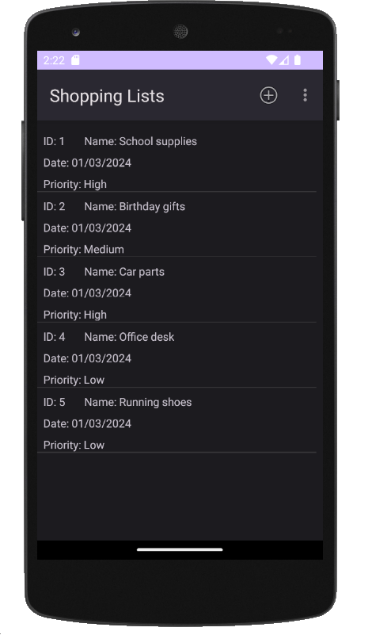

# Shopping List Manager

Desenvolvimento de uma aplicação Android para Controle de Lista de Compras. 

## 🚀 Descrição

O objetivo do **shopping-list-manager** é desenvolver um aplicativo mobile Android nativo para a matéria de Java Mobile do curso de Especialização em Java da Universidade Tecnológica Federal do Paraná - UTFPR.
O desenvolvimento foi realizado utilizando a linguagem de programação Java e a biblioteca de persistência Room, que oferece uma camada de abstração sobre o banco de dados SQLite.

## 📌 Versão APIs
- Minimum API Level 16
- Target API Level 33

---
[Linkedin](https://www.linkedin.com/in/wellitonfernandes/) 😊